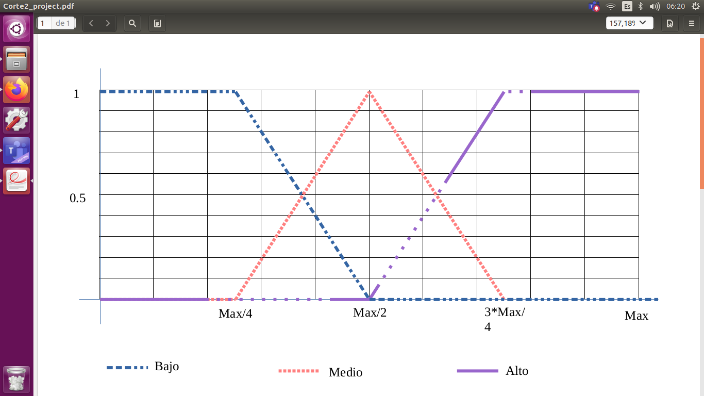
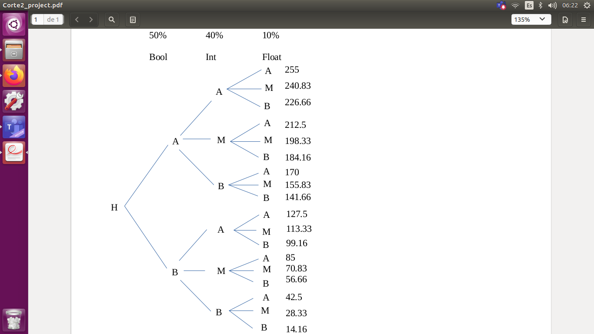

# project_ros_nodes

Proyecto Nodos ROS
=============

Node A (Talker.py) will listen to the data sent by the Arduino, which takes data from the circuit implemented with Photoresistor for the integer value, button for the Boolean and as an output a led to which PWM is sent.

Nodes B, C and D receive this data sent and from the values it is searched by means of fuzzy logic to give the belonging to the ALTO/MEDIO/BAJO sets.



The nodes E, F and G will receive these memberships and will select the highest percentage of membership as the set to which the variables sent by node A belong, a string of one character is sent with the initial of the set ( A, M or B). 

Finally in node H, this classification of the variables arrives and a decision tree based on percentages is made to decide the PWM value for the led in the circuit, this tree gives a percentage of 50% to the bool, 40% to the int and 10% to float Internally the bool from A to B handles percentages: for bool [0 1], int [1 0.6 0.2] and float [1 0.5 0]. In the arduino node it will receive this value that goes from 1-18 and it will multiply it by (255/18) so that it is scaled up to 255.



Execution created node

``` 
$ roscore
$ rosrun project_ros_nodes _.py
```

**Arduino as ROS Node**

<https://youtu.be/MOBSb6cA7kY> Until 6:11 where the inside of the arduino IDE finds the Hello World example from the ros_lib library

<https://youtu.be/lkyUqMVJBQ0> This tutorial will be in charge of uploading the program to the arduino and running it as a ROS node

**Note**

Every time the Arduino node is run, it is necessary to give the permissions to the port

``` 
sudo chmod 777 /dev/ttyUSB
```
To run the Arduino file as a ros node we execute the following line

``` 
rosrun rosserial_python serial_node.py /dev/ttyUSB0
```

TEMPLATE PARA GENERAR EL README.md GIT
==============

*This will be Italic*

**This will be Bold**

- This will be a list item
- This will be a list item

1. This will be a numerated list 
2. This will be a numerated list 

``` 
this will be a code segment
```

> this will be a definition

<http://url> this will be a web link

<!--this will a comment-->

This will a title
--------------
